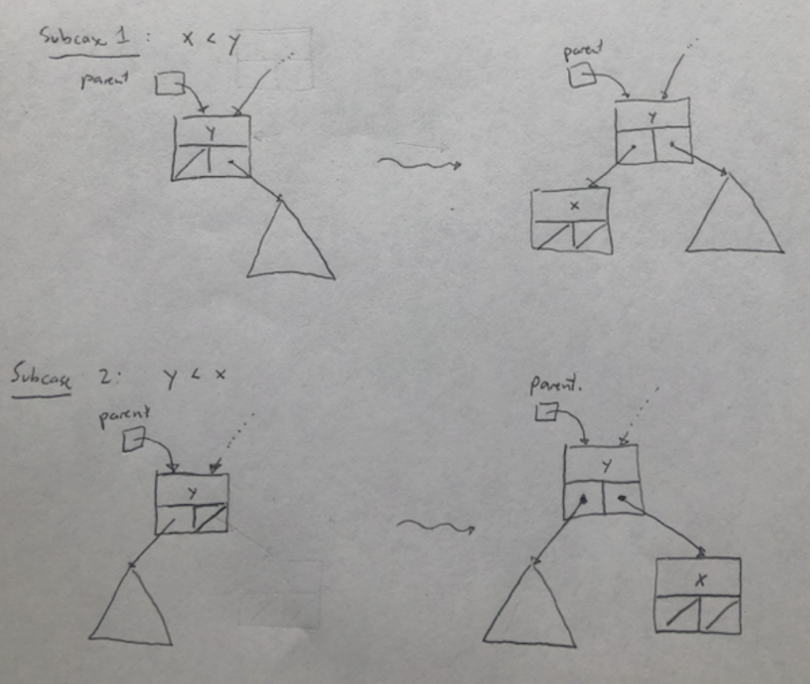
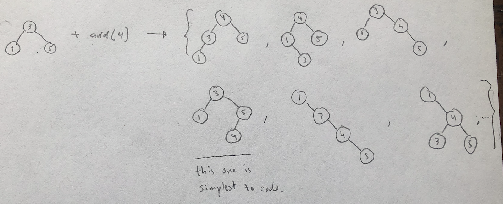
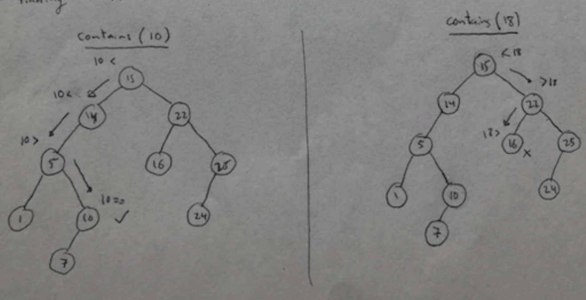

# Exercise 11.2 - 🔍 Binary Search Tree

## 🎯 Objectives

- **Implement** binary search tree functions recursively in Java.

## 🔨 Setup

1. Clone the repo (or download the zip) for this exercise, which you can find [here](https://github.com/JAC-CS-Programming-4-W23/E11.2-Binary-Search-Tree).
2. Start IntelliJ, go to `File -> Open...`, and select the cloned/downloaded folder.
3. If at the top it says "Project JDK is not defined", click "Setup JDK" on the top right, and select the JDK version you have installed on your machine.

    

4. To get the unit tests to work, open `TreeSetTest.java` and add JUnit to the classpath:

    

    - Just click "OK" on the resulting dialogue window and all the test-related red squigglies should disappear.

## 🔍 Context

A Binary Search Tree is a binary tree where each node satisfies the binary search tree property:

i.e. the left subtree of a given node contains values that are strictly less than the node's value, and the right subtree contains values that are strictly greater than the node's value.

## 🚦 Let's Go

1. `boolean add(Node<T> current, T element)`

   - Case 1: Tree is empty

   

   - Case 2: Tree is not empty

     1. Find the parent node where the element will be placed.
     2. Create a new node.

     

   Adding a new node can go in several potential places:

   

   Where should we add the new node? At the place where `contains()` will find it!

2. `boolean contains(Node<T> current, T element)`

   - Contains behaves similarly to binary search where it goes down the tree, and for each node, checks if the element its trying to find would be in the left or right subtrees.

   

---

